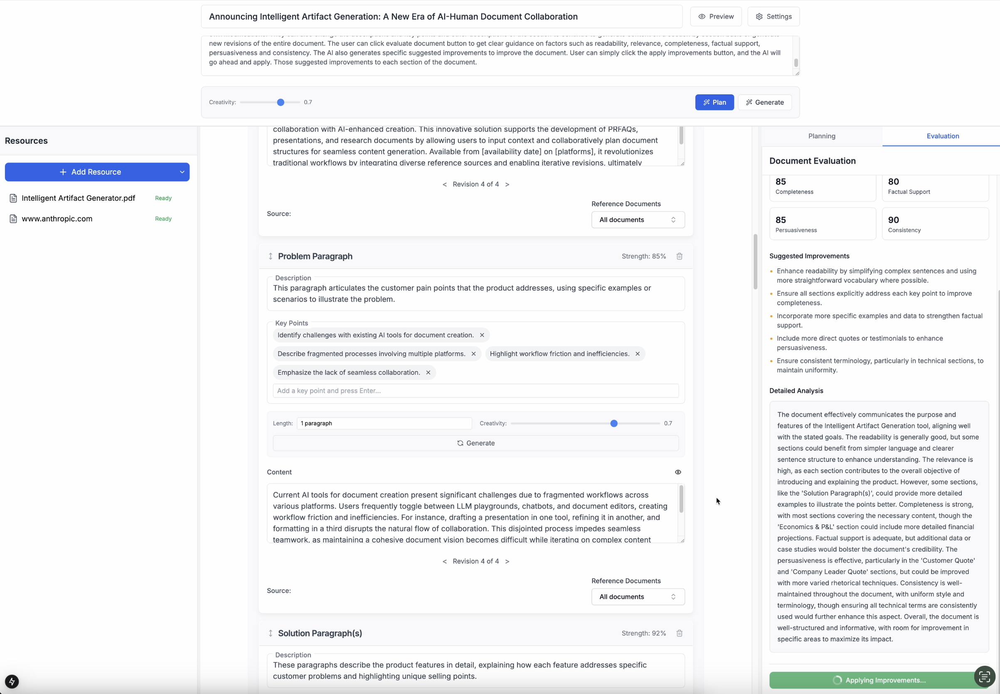

# AI-Powered Artifact Generator

An intelligent artifact generation tool built with Next.js that helps create structured documents using AI assistance. The application supports multiple document types, collaborative planning, and context-aware content generation.

## Features

- 🤖 AI-powered document planning and generation
- 📝 Multiple document templates (Marketing, Technical, Research)
- 🔄 Real-time content preview with Markdown support
- 📊 Document evaluation and improvement suggestions
- 📚 Context-aware generation using reference materials
- 🎨 Customizable section management
- 📱 Responsive layout with resizable panels

## Screenshot



## Tech Stack

- **Frontend**: Next.js 15.0, React, TypeScript
- **Styling**: Tailwind CSS
- **AI Integration**: OpenAI API, Amazon Bedrock
- **Backend**: FastAPI (Python)
- **Markdown**: React-Markdown with GFM support


## Getting Started

1. Clone the repository
2. Install dependencies:

```bash
npm install
```

3. Set up environment variables:
Create a `.env.local` file with:
```
# AI Provider (Required)
AI_PROVIDER=openai  # or bedrock
OPENAI_API_KEY=your_openai_key  # Required if using OpenAI
ANTHROPIC_API_KEY=your_anthropic_key  # Required if using Anthropic

# AWS Configuration (Required if using Bedrock)
AWS_ACCESS_KEY_ID=your_aws_key
AWS_SECRET_ACCESS_KEY=your_aws_secret
AWS_REGION=your_aws_region
AWS_PROFILE=your_aws_profile

# Backend Configuration
EMBEDDING_PROVIDER=openai  # or bedrock
```

4. Set up the backend:
```bash
# Create and activate Python virtual environment
python -m venv venv
source venv/bin/activate 

# Install backend dependencies
cd backend
pip install -r requirements.txt

# Start the FastAPI server
uvicorn app:app --reload --port 8000
```

5. Start the development server:
```bash
npm run dev
```

6. Open [http://localhost:3000](http://localhost:3000) with your browser to see the result.

You can start editing the page by modifying `app/page.tsx`. The page auto-updates as you edit the file.